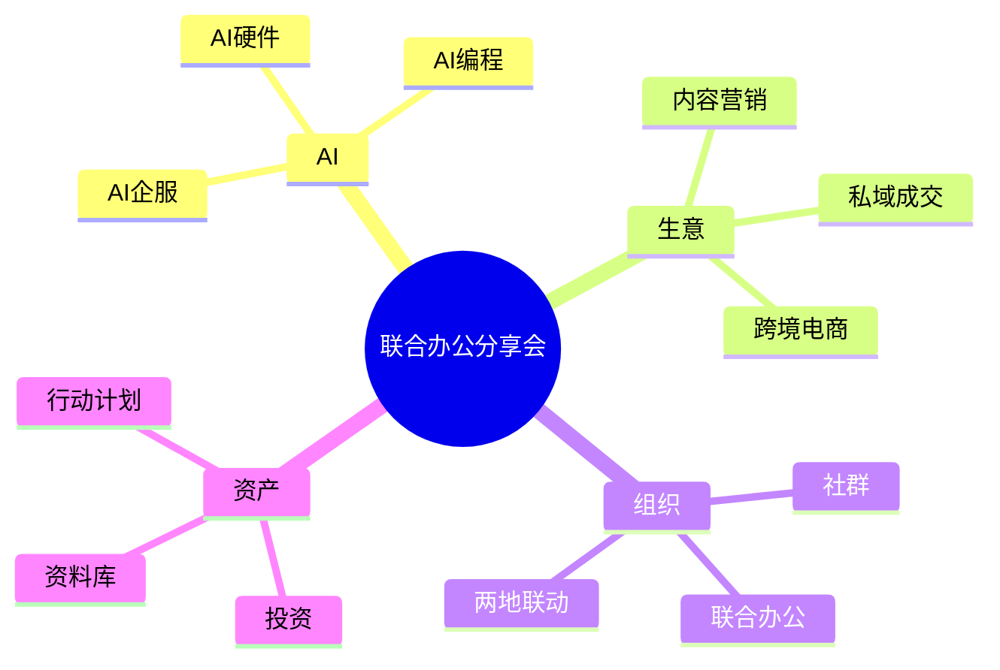

# 主题矩阵

```mermaid
mindmap
  root((联合办公分享会))
    AI
      AI企服
      AI编程
      AI硬件
    生意
      内容营销
      私域成交
      跨境电商
    组织
      社群
      联合办公
      两地联动
    资产
      投资
      资料库
      行动计划
```
